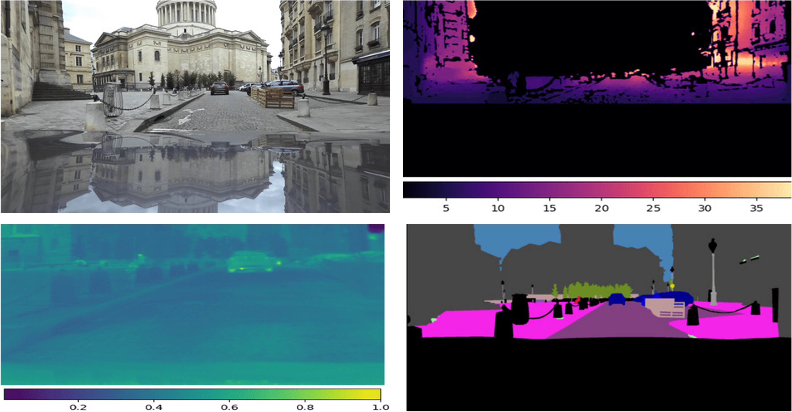

# DeepLabv3Plus-Pytorch

DeepLabv3, DeepLabv3+ and Segformer with pretrained models for Pascal VOC & Cityscapes InfraParis and MUAD.

## Quick Start 

<div>

</div>

### 1. Available Architectures
Specify the model architecture with '--model ARCH_NAME' and set the output stride using '--output_stride OUTPUT_STRIDE'.

| DeepLabV3            | DeepLabV3+               | Segformer |
|----------------------|--------------------------|-----------|
| deeplabv3_resnet50   | deeplabv3plus_resnet50   | B0        |
| deeplabv3_resnet101  | deeplabv3plus_resnet101  | B1        |
| deeplabv3_mobilenet  | deeplabv3plus_mobilenet  | B2        |
| deeplabv3_hrnetv2_48 | deeplabv3plus_hrnetv2_48 | B3        |
| deeplabv3_hrnetv2_32 | deeplabv3plus_hrnetv2_32 | B4        |
| deeplabv3_xception   | deeplabv3plus_xception   | B5        |
All pretrained models: [googledrive](link)

### 2. Deeplab information

If you need Deeplab or DeepLabV3+ please follow the original [code](https://github.com/VainF/DeepLabV3Plus-Pytorch)

### 2. Load the pretrained model:
```python
model.load_state_dict( torch.load( CKPT_PATH )['model_state']  )
```
### 3. Visualize segmentation outputs:
```python
outputs = model(images)
preds = outputs.max(1)[1].detach().cpu().numpy()
colorized_preds = val_dst.decode_target(preds).astype('uint8') # To RGB images, (N, H, W, 3), ranged 0~255, numpy array
# Do whatever you like here with the colorized segmentation maps
colorized_preds = Image.fromarray(colorized_preds[0]) # to PIL Image
```

### 4. Atrous Separable Convolution

**Note**: pre-trained models in this repo **do not** use Seperable Conv.

Atrous Separable Convolution is supported in this repo. We provide a simple tool ``network.convert_to_separable_conv`` to convert ``nn.Conv2d`` to ``AtrousSeparableConvolution``. **Please run main.py with '--separable_conv' if it is required**. See 'main.py' and 'network/_deeplab.py' for more details. 

### 5. Prediction
Single image:
```bash
python predict.py --input ~/Datasets/Cityscapes/leftImg8bit/train/bremen/bremen_000000_000019_leftImg8bit.png  --dataset cityscapes --model deeplabv3plus_mobilenet --ckpt checkpoints/best_deeplabv3plus_mobilenet_cityscapes_os16.pth --save_val_results_to test_results
```

Image folder:
```bash
python predict.py --input ~/Datasets/Cityscapes/leftImg8bit/train/bremen  --dataset cityscapes --model deeplabv3plus_mobilenet --ckpt checkpoints/best_deeplabv3plus_mobilenet_cityscapes_os16.pth --save_val_results_to test_results
```

## Results

### 1. Performance on INFRA Paris (19 classes, 1024 x 2048)

Training: 768x768 random crop  
validation: 1024x2048

|  Model          | Batch Size  | FLOPs  |   RGB test mIoU  | IR test mIoU |
| :--------        | :-------------: | :----:   | :-----------: | :--------: | :--------: |
| DeepLabV3Plus-MobileNet   | 16      |  17.0G      |    65.65  | 31.158 |
| DeepLabV3Plus-ResNet101     | 8     |  83.4G     |   69.040  | 34.445 |
| Segformer   B0  | 8     |  -    |   64.160  | 31.032 |
| Segformer   B1  | 8     |  -    |   68.006  | 35.313 |
| Segformer   B2  | 8     |  -    |   69.852  | 35.313 |
| Segformer   B3  | 8     |  -    |   68.803  | 36.623 |
| Segformer   B4  | 8     |  -    |   70.333  | 36.708 |
| Segformer   B5  | 8     |  -    |   70.595  | 36.161 |

### 2. Performance on MUAD (19 classes, 1024 x 2048)

Training: 768x768 random crop  
validation: 1024x2048

|  Model          | Batch Size  | FLOPs  | train/val OS   |  train mIoU  | val mIoU |
| :--------        | :-------------: | :----:   | :-----------: | :--------: | :--------: |
| DeepLabV3-ResNet101         | 16      |  72.1G     |  16/16   |  0.805  | 0.811 |
| DeepLabV3Plus-MobileNet   | 16      |  17.0G      |  16/16   |  0.861  | 0.862 |
| DeepLabV3Plus-ResNet50    | 16      |   62.7G     |  16/16   |  0.877  | 0.877 |
| DeepLabV3Plus-ResNet101     | 8     |  83.4G     |  16/16   |  0.877  | 0.877 |


## Prepare Datasets


## InfraParis

### 1. Download cityscapes and extract it to 'datasets/data/cityscapes'

```
/datasets
    /data
        /INFRA10
            /Left
            /Infra
            /semantic_segmentation_truth
            /semantic_segmentation_truth_reprojected_IR
```

### 2. Train your model on InfraParis for RGB images

Deeplab training
```bash
python main.py --data_root "PATHTO_BDDs/INFRA10" --dataset "infraPARIS" --model "deeplabv3plus_resnet101" --output_stride 8 --batch_size 16 --crop_size 768 --gpu_id 0,1 --lr 0.1
```
Segformer training
```bash64.160
python main_segformer.py --data_root "PATHTO_BDDs/INFRA10" --dataset "infraPARIS" --model "B0" --batch_size 8 --crop_size_h 1024 --crop_size_w 1024 --gpu_id 0,1 --lr 0.0001 --total_itrs 40000  --ckpt_segformer './pretrained/mit_b0.pth' --weight_decay 0.01 
```


### 2. Train your model on InfraParis for Infrared images

Deeplab training
```bash
python main.py --data_root "PATHTO_BDDs/INFRA10" --dataset "infraPARIS_IR" --model "deeplabv3plus_resnet101" --output_stride 8 --batch_size 16 --crop_size 250 --gpu_id 0,1 --lr 0.1 
```

Segformer training
```bash
python main_segformer.py --data_root "PATHTO_BDDs/INFRA10" --dataset "infraPARIS_IR" --model "B0" --batch_size 8 --crop_size_h 250 --crop_size_w 250 --gpu_id64.160 0 --lr 0.0001 --total_itrs 40000  --ckpt_segformer './pretrained/mit_b0.pth' --weight_decay 0.01
```


## MUAD

### 1. Odgt file sample

"fpath_img": the path of image. "fpath_segm": the path of label. "width": the width of image. 'height': the height of image

```
{"fpath_img": "train2/leftImg8bit/003506_leftImg8bit.png", "fpath_segm": "train2/leftLabel/003506_leftLabel.png", "width": 2048, "height": 1024}
{"fpath_img": "train2/leftImg8bit/001108_leftImg8bit.png", "fpath_segm": "train2/leftLabel/001108_leftLabel.png", "width": 2048, "height": 1024}
{"fpath_img": "train2/leftImg8bit/002319_leftImg8bit.png", "fpath_segm": "train2/leftLabel/002319_leftLabel.png", "width": 2048, "height": 1024}
```


## Reference


[1] [InfraParis: A multi-modal and multi-task autonomous driving dataset](https://arxiv.org/abs/2309.15751)

[2] [MUAD: Multiple Uncertainties for Autonomous Driving, a benchmark for multiple uncertainty types and tasks](https://arxiv.org/abs/2203.01437)

[3] [SegFormer: Simple and Efficient Design for Semantic Segmentation with Transformers](https://arxiv.org/abs/2105.15203)

[4] [Rethinking Atrous Convolution for Semantic Image Segmentation](https://arxiv.org/abs/1706.05587)

[5] [Encoder-Decoder with Atrous Separable Convolution for Semantic Image Segmentation](https://arxiv.org/abs/1802.02611)
